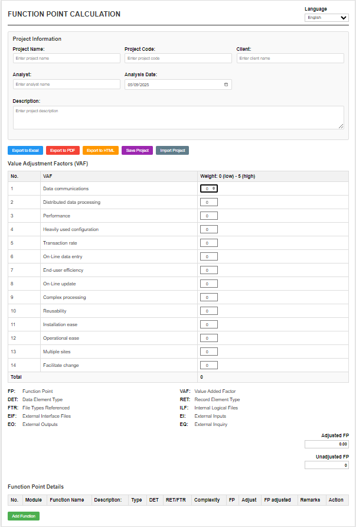

<p align="center">
    
</p>

# Function Point Calculator

**Function Point Calculator** là công cụ giúp tính toán độ phức tạp phần mềm dựa trên phương pháp **Function Point Analysis (FPA)** – tiêu chuẩn ISO/IEC 20926. Ứng dụng chạy hoàn toàn trên trình duyệt, không cần cài đặt.

---

## Tính năng

- **Tính UFP, VAF, AFP**: Đầy đủ các bước tính Function Point.
- **Xuất báo cáo**: Hỗ trợ Excel, PDF, HTML.
- **Giao diện hiện đại**: Tương thích máy tính & di động.
- **Đa ngôn ngữ**: Tiếng Anh, Tiếng Việt.
- **Offline**: Dữ liệu xử lý trên trình duyệt, bảo mật.

---

## Mục tiêu

- Chuẩn hóa quy trình ước lượng phần mềm.
- Giảm sai số khi lập kế hoạch dự án.
- Tạo báo cáo chuyên nghiệp cho thuyết trình/lưu trữ.

---

## Công thức

1. **UFP**:  
    `UFP = Σ (số lượng × trọng số độ phức tạp)`

2. **VAF**:  
    `VAF = 0.65 + (0.01 × Σ Fi)`  
    *(Fi ∈ [0, 5], gồm 14 yếu tố kỹ thuật)*

3. **AFP**:  
    `AFP = UFP × VAF`

---

## Hướng dẫn sử dụng

1. Mở `index.html` trên trình duyệt.
2. Nhập thông tin dự án & yếu tố kỹ thuật (VAF).
3. Thêm chức năng phần mềm (DET, RET/FTR, loại chức năng).
4. Nhấn **"Calculate"** để xem UFP, VAF, AFP.
5. Xuất báo cáo: **"Export to Excel"**, **"Export to PDF"**, **"Export to HTML"**.
6. Lưu/tải dự án: **"Save Project"**, **"Import Project"**. (tái sử dụng)

---

## 📁 Cấu trúc thư mục

```bash
.
├── index.html             # Giao diện chính
├── css/
│   └── styles.css         # Định dạng giao diện
├── js/
│   └── script.js          # Logic tính toán & xuất báo cáo
├── capture/
│   └── image.png          # Hình minh họa
└── README.md              # Tài liệu hướng dẫn
```

---

## Công nghệ sử dụng

- **HTML5, CSS3, JavaScript**: Giao diện & xử lý logic.
- **ExcelJS**: Xuất file Excel (.xlsx).
- **FileSaver.js**: Tải file xuống.
- **jsPDF**: Xuất PDF.
- **html2canvas**: Chụp ảnh màn hình HTML.

---

## Lưu ý

- Ứng dụng chạy hoàn toàn trên trình duyệt, không gửi dữ liệu lên server.
- File xuất ra dùng trực tiếp cho báo cáo/lưu trữ.
- Dữ liệu định dạng rõ ràng, phù hợp báo cáo kỹ thuật.

---

## Đối tượng sử dụng

- Quản lý dự án phần mềm (PM).
- Kỹ sư phần mềm, BA.
- Sinh viên CNTT.
- Đội kiểm thử, đánh giá effort.

---

## Giấy phép

Phát hành theo MIT License. Tự do chỉnh sửa, chia sẻ, triển khai cho mục đích cá nhân hoặc thương mại.